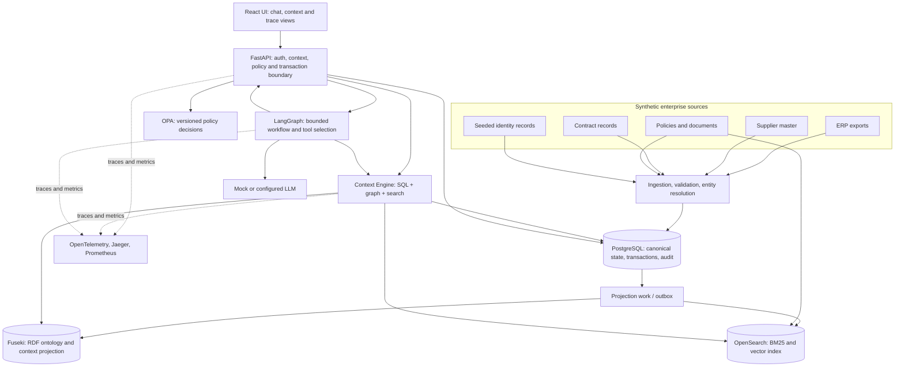
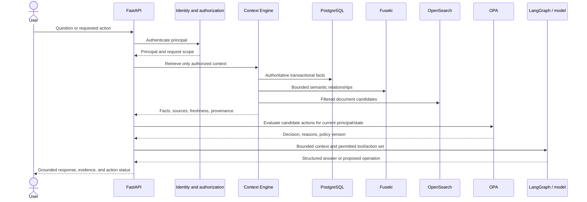

# Enterprise Context Graph Agent
## End-to-End Architecture and Implementation Plan

**Status:** Proposed implementation baseline
**Project type:** Synthetic-data portfolio project; production-style reference architecture
**Primary outcome:** A locally runnable procurement context platform that explains and safely simulates or executes policy-governed actions.

---

## 1. Purpose and Scope

This project demonstrates how enterprise context can be assembled from transactional records, semantically linked through an ontology and RDF graph, enriched with policy documents, and used by a bounded agent workflow. It is not a general-purpose autonomous agent and it does not treat an LLM as a source of truth or an authorization mechanism.

The central demonstration is:

> Given a user and a purchase requisition, explain whether it can become a purchase order, identify the evidence and policies behind the decision, and safely simulate or execute the action subject to authorization, approval, and transaction controls.

All business records and documents are synthetic. The project must work locally without paid cloud services. Optional cloud adapters and Terraform are added only after the local path is complete.

### Non-goals for the initial release

- Supporting arbitrary enterprise schemas or arbitrary user-generated SPARQL.
- Claiming production certification, regulatory compliance, or unrestricted multi-tenancy.
- Implementing a multi-agent system, graph neural network, or every possible graph backend.
- Using an LLM to decide access, policy, entity merges, or transaction validity.

---

## 2. Architectural Decisions

### 2.1 System of record and projections

| Information | Authority | Derived representations |
|---|---|---|
| Purchase requisitions, purchase orders, contracts, users, approvals, audit, idempotency | PostgreSQL | RDF projection; search metadata where needed |
| Raw source records and source identifiers | Immutable synthetic source files plus ingestion ledger | Canonical mappings and graph provenance |
| Canonical entity mappings and match decisions | PostgreSQL | Canonical RDF entity and alias relationships |
| Ontology, SHACL shapes, SKOS taxonomy | Version-controlled Turtle files | Loaded ontology graph |
| Policy rules | Version-controlled OPA bundles | Versioned policy decision records |
| Policy and contract document text | Version-controlled synthetic documents | OpenSearch chunks and vectors |
| Computed allowed actions | Request-time result from action catalog + OPA | Auditable decision snapshot only |

The RDF graph and OpenSearch are read projections, not authorities for writes. Any write workflow reloads authoritative transactional facts from PostgreSQL and reevaluates policy immediately before committing.

### 2.2 Projection consistency

- Ingestion and writes are idempotent.
- PostgreSQL owns an outbox or projection-work table for graph and search updates.
- Projectors record source version, projection version, processing status, and last successful watermark.
- Rebuilds can recreate projections from authoritative records and versioned documents.
- Context responses report relevant freshness/version metadata. Stale projections may support explanation, but cannot authorize a write.
- A portfolio-scale implementation uses PostgreSQL-backed jobs, not Kafka. A queue can be added only if measured workload justifies it.

### 2.3 Policy and action authority

OPA is the single authority for dynamic procurement and authorization policy decisions. The API remains the final enforcement boundary by requiring a fresh OPA decision, checking request shape and transaction invariants, and committing state changes atomically. Policy logic is not duplicated in Python.

OPA returns a typed decision including `allowed`, `approval_required`, `reason_codes`, `explanations`, and `policy_version`. Write operations fail closed if OPA cannot be reached. The action catalog defines candidate action types and required input shapes; OPA determines whether a specific principal may perform one against current facts.

### 2.4 Identity and authorization

- A principal is distinct from the requisition's buyer, requester, or approver.
- Use a local development identity mode with seeded principals and signed credentials; mark it as local-only. Keep authentication behind an interface that can later accept an OIDC issuer.
- Authorization is evaluated for the current principal, business unit, resource, action, and current policy inputs.
- Apply authorization filters before SQL, graph, or document content reaches the LLM.
- Never fetch broad context and rely on the model to conceal unauthorized facts.

### 2.5 Approvals and safe writes

An approval request is a persisted state machine in PostgreSQL. It binds to the principal, requested action, exact arguments, resource version, policy version, supporting context, expiry, and authorized approver. On resume, the service checks approver authority, approval status and expiry, reloads resource state, and reruns authorization and OPA. Changed state or policy can invalidate the approval.

PO creation uses a durable idempotency record with a unique constraint. In one transaction, it creates the PO, transitions the requisition, writes the audit event, and enqueues projection work. Use row locking or optimistic concurrency so concurrent requests cannot convert the same requisition twice. `DRY_RUN=true` is the default.

### 2.6 Graph, ontology, and provenance

- Stable concepts and relationships belong in the ontology; changing business rules do not.
- SHACL validates graph structure and data quality. It is not the business policy engine.
- RDF/OWL inference is explicit: configure and test the selected RDFS/OWL entailment method; RDFLib alone does not infer subclass membership automatically.
- Use stable URI construction from canonical identifiers, not display names.
- Record provenance at assertion level. A canonical entity may have facts from multiple systems, so a single `originatesFrom` relationship is insufficient. Use named graphs and/or a PROV-O-aligned assertion model containing source record, source system, observed time, valid time when known, and transformation/match lineage.
- Document open-world semantics and where the application uses closed-world expectations. SHACL and domain validation supply those closed-world checks.
- Keep computed user permissions and allowed actions out of the durable semantic truth model; retain only versioned decision snapshots when needed for audit.

### 2.7 Retrieval and untrusted content

OpenSearch combines BM25 and k-NN candidates with Reciprocal Rank Fusion. Search records retain document ID, version, chunk ID, source, effective dates, document type, and authorization metadata. Authorization and metadata filters are applied before results reach the model. Retrieved text is untrusted evidence, never executable instructions. The model uses an allowlisted set of typed tools; tool authorization and validation remain server-side.

### 2.8 Local and cloud execution

The default local profile runs PostgreSQL, Fuseki, OpenSearch, OPA, API, web UI, Jaeger, and Prometheus. Grafana and optional services use Compose profiles. The default LLM is deterministic mock; local sentence-transformer embeddings provide semantic retrieval without paid APIs, with the initial model download and resource needs documented. OpenAI-compatible and Bedrock providers are optional configurations.

The graph interface is based on required application capabilities and has adapter conformance tests. Fuseki is the initial and tested backend. Neptune is a later optional adapter, not a drop-in compatibility claim.

---

## 3. Architecture Overview



### Request-time trust boundary



For writes, the API repeats authentication, resource authorization, current-state reads, and OPA evaluation immediately before the database transaction. The model cannot directly call the database, OPA, or unrestricted SPARQL endpoint.

---

## 4. Canonical Domain Model

Use Pydantic domain/API schemas and explicit persistence mappings. Avoid making RDF classes, ORM rows, and API request payloads the same type.

| Model | Key fields and behavior |
|---|---|
| `Principal` | Stable ID, roles, business-unit memberships, active status, identity source. Not synonymous with `Buyer`. |
| `SourceRecord` | Source system, source record ID, raw payload/reference, observed time, ingestion run, validation state. Immutable after ingestion. |
| `CanonicalEntity` | Stable canonical ID, entity type, preferred name, lifecycle status, created/updated timestamps. |
| `EntityMatchDecision` | Source record, canonical entity, method, feature evidence, score, decision/reviewer, model/rule version, timestamp. Supports review and reversal. |
| `Supplier` | Canonical entity reference, status, risk, approved categories, country, source assertions. |
| `Buyer` | Person/canonical entity reference, business-unit relationship, approval limit, active status. |
| `BusinessUnit` | Stable ID, name, hierarchy/parent where applicable. |
| `Product` / `ProductCategory` | Product identifiers and category links to a SKOS concept. |
| `PurchaseRequisition` | ID, supplier, requester, buyer, business unit, lines, amount, currency, state, row/version token, source references. |
| `PurchaseOrder` | ID, originating requisition, supplier, buyer, lines, amount, currency, status, idempotency reference, timestamps. |
| `Contract` | ID, supplier, dates, status, category/terms restrictions, source references, document link. |
| `PolicyDocument` | Stable document/version IDs, type, effective dates, source, ACL metadata, content checksum. |
| `PolicyDecision` | Principal, action, resource/version, typed inputs, allow/deny/approval result, reasons, policy version, evaluated time. |
| `ApprovalRequest` | Requested action and exact arguments, resource/policy versions, requester, approver scope, expiry, status, decision/audit history. |
| `IdempotencyRecord` | Principal/scope, key, request hash, execution status, response reference; unique constraint prevents duplicate operation. |
| `AuditEvent` | Actor, action, resource, decision, timestamps, request/trace ID, before/after references. Append-only at application level. |
| `ProvenanceAssertion` | Subject/predicate/object or fact reference, source record/system, valid/observed time, transformation, confidence where relevant. |
| `ContextEnvelope` | Resolved entities, authorized facts, relationships, documents, policy results, allowed actions, provenance, freshness and partial-context warnings. |

### State and value rules

- Use explicit enums for requisition, supplier, PO, approval, and ingestion states.
- Store monetary values as fixed-precision decimal plus ISO currency code; never use binary floats for transaction amounts.
- Store timestamps in UTC. Preserve source timestamps and timezone/precision information when available.
- A requisition may produce at most one active PO unless a clearly defined split-order rule is added.
- Distinguish missing, invalid, unknown, and not-applicable values; do not silently convert them to defaults.

---

## 5. Initial Ontology and Graph Contract

### Core classes

- `Entity`, `Person`, `Organization`, `BusinessPartner`
- `Supplier`, `Buyer`, `BusinessUnit`
- `Product`, `ProductCategory`
- `BusinessDocument`, `PurchaseRequisition`, `PurchaseOrder`, `Contract`
- `Policy`, `BusinessAction`, `ProcessState`, `SourceSystem`
- Provenance resources or named graphs for source assertions

### Initial class hierarchy

```text
Person rdfs:subClassOf Entity
Organization rdfs:subClassOf Entity
BusinessPartner rdfs:subClassOf Organization
Supplier rdfs:subClassOf BusinessPartner
Buyer rdfs:subClassOf Person
PurchaseRequisition rdfs:subClassOf BusinessDocument
PurchaseOrder rdfs:subClassOf BusinessDocument
Contract rdfs:subClassOf BusinessDocument
```

### Initial object properties

`createdBy`, `requestedBy`, `ownedByBuyer`, `belongsToBusinessUnit`, `hasSupplier`, `containsProduct`, `hasCategory`, `createdFrom`, `governedByContract`, `governedByPolicy`, `hasState`, `hasCanonicalEntity`, `hasAlias`, `hasSourceAssertion`, `hasProvenance`, `permitsAction`, and `prohibitsAction`.

Use inverse, domain, range, equivalence, or disjointness axioms only where their semantics are correct. Do not assume OWL cardinalities enforce transactions or data completeness. SHACL and API/database constraints handle those requirements.

### Initial datatype properties

`canonicalId`, `sourceRecordId`, `sourceSystemCode`, `displayName`, `amount`, `currency`, `createdAt`, `updatedAt`, `riskRating`, `confidenceScore`, and `effectiveFrom` / `effectiveTo`.

### SKOS taxonomy

Create a small, versioned vocabulary for Technology, Professional Services, and Facilities, with narrower concepts, preferred labels, and alternative labels. Products reference concepts by URI rather than duplicated free-text category names.

### Graph service contract

Expose bounded methods such as `get_requisition_context`, `get_supplier_relationships`, `get_contract_context`, `resolve_entity`, and `run_readonly_sparql`. Common workflows use parameterized templates. Optional generated SPARQL must be parsed, restricted to `SELECT`/`ASK`, timeout-limited, result-limited, authorization-scoped, and logged. Mutations are not exposed through agent tools.

---

## 6. Repository Layout

```text
enterprise-context-agent/
├── README.md
├── IMPLEMENTATION_PLAN.md
├── LICENSE
├── Makefile
├── docker-compose.yml
├── .env.example
├── pyproject.toml
├── apps/
│   ├── api/
│   └── web/
├── src/
│   ├── config/
│   ├── domain/
│   ├── ingestion/
│   ├── entity_resolution/
│   ├── ontology/
│   ├── graph/
│   ├── retrieval/
│   ├── context_engine/
│   ├── policy/
│   ├── agents/
│   ├── tools/
│   ├── evaluation/
│   ├── observability/
│   └── security/
├── ontology/
│   ├── enterprise.ttl
│   ├── shapes.ttl
│   └── taxonomy.ttl
├── policies/
│   ├── procurement.rego
│   └── authorization.rego
├── data/
│   ├── raw/
│   ├── documents/
│   └── golden/
├── scripts/
│   ├── generate_synthetic_data.py
│   ├── ingest_data.py
│   ├── rebuild_projections.py
│   └── run_evaluation.py
├── tests/
│   ├── unit/
│   ├── integration/
│   ├── e2e/
│   └── evaluation/
├── infra/
│   ├── docker/
│   └── terraform/
└── docs/
    ├── architecture.md
    ├── ontology.md
    ├── entity-resolution.md
    ├── context-engine.md
    ├── agent-design.md
    ├── evaluation.md
    ├── security.md
    ├── deployment.md
    └── adr/
```

Keep the Python package as the owner of domain behavior; `apps/api` should primarily compose dependencies and expose HTTP contracts. Avoid splitting a single domain feature across many tiny packages before there is a demonstrated need.

---

## 7. Detailed Implementation Roadmap

Every phase has an exit gate. Do not proceed to a dependent phase while its gate is failing.

### Phase 0 — Architecture baseline and contracts

**Deliver:** This plan, ADRs for key boundaries, initial threat model, domain/state definitions, and API/graph/policy contracts. Decide the seeded local identity flow, projection consistency behavior, and supported local resources.

**Gate:** No unresolved authority for transactional facts, policy decisions, authentication, or write approval.

### Phase 1 — Repository, configuration, and local runtime

**Deliver:** Python 3.12 package, Pydantic v2, FastAPI shell, React/Vite shell, Ruff, type checking, pytest, GitHub Actions, Compose services, health checks, persistent volumes, environment configuration, database migrations, OpenAPI, and structured logging.

Compose core: PostgreSQL, Fuseki, OpenSearch, OPA, API, web, Jaeger, and Prometheus. Grafana is an optional profile. Pin service/image versions. Document OpenSearch memory settings and local resource expectations.

**Gate:** Fresh local start reaches healthy services; API and web health checks pass; CI runs lint, type check, and unit tests.

### Phase 2 — Synthetic source data and ingestion foundation

**Deliver:** Seeded generator for at least 100 suppliers, 500 products, 50 buyers, 10 business units, 1,000 requisitions, 1,000 POs, and 200 contracts. Generate multiple source systems, aliases, conflicts, missing/invalid fields, and adversarial policy text. Each source record includes source system and source ID. Add ingestion runs, checksums, idempotency, validation reports, and quarantine records.

**Gate:** Same seed yields reproducible data; reruns do not duplicate records; invalid inputs are retained with explicit reasons.

### Phase 3 — Canonical relational model and entity resolution

**Deliver:** PostgreSQL migrations and repositories; source-record persistence; canonical entity and alias tables; normalization; exact identifiers; candidate blocking; RapidFuzz scoring; human-review candidates; reversible merge/split history; match evidence and versioning.

Calibrate thresholds using labeled synthetic pairs. Keep embedding similarity as a later opt-in candidate-generation experiment, not the first-line merge criterion.

**Gate:** Unit and golden tests report pairwise precision, recall, F1, false merge and false split rates; original values are never lost; review and reversal paths are tested.

### Phase 4 — Ontology, SHACL, provenance, and graph projection

**Deliver:** Initial ontology, SKOS taxonomy, SHACL shapes, explicit reasoning setup, canonical RDF projector, assertion-level provenance, named graphs, graph service interface, Fuseki adapter, parameterized SPARQL templates, query limits, tracing, and data-quality output.

**Gate:** Test subclass inference; validate valid and invalid graph records; prove invalid records are quarantined/observable; test allowed `SELECT`/`ASK` and blocked updates, timeout, result limits, and URI stability.

### Phase 5 — Relational transactions and projection synchronization

**Deliver:** Transactional requisition/PO repositories; database constraints and indexes; audit and idempotency records; outbox/projector worker; rebuild and replay scripts; projection version and freshness metadata.

**Gate:** A committed transaction produces retry-safe projection work; projector retries are idempotent; rebuild matches expected graph state; concurrent conversion cannot create duplicate POs.

### Phase 6 — Document indexing and hybrid retrieval

**Deliver:** Synthetic policies, contracts, procedures, document metadata and versions; chunking; OpenSearch mappings; BM25 and vector queries; local embedding interface; mock/external provider interfaces; RRF; authorization and metadata filtering; ranking explanations and citations.

**Gate:** Tests validate expected document retrieval, ACL filtering before model access, citation/version mapping, RRF explanation, and index rebuild. Record initial Recall@5/10, Precision@5, MRR, nDCG, latency, and index size.

### Phase 7 — OPA policy service and allowed-action evaluation

**Deliver:** Versioned Rego policies for requisition state, supplier status/risk, business-unit scope, approval limit, category restrictions, manager approval, and roles. Typed input and output models; candidate action catalog; OPA client; structured reason codes and human explanations.

**Gate:** Policy test cases cover each allow/deny/approval path; API fails closed when OPA is unavailable; action discovery and execution use the same policy bundle and input semantics.

### Phase 8 — Context Engine

**Deliver:** Typed context envelope and deterministic routing for SQL, graph, search, and combined questions. Track provenance, document IDs, query/source metadata, freshness, partial failures, and confidence warnings. Authorization filtering occurs before context is returned to the agent.

**Gate:** Route tests for spend aggregation, graph traversal, policy lookup, requisition action eligibility, and partial graph/search outage.

### Phase 9 — LangGraph workflow and agent tools

**Deliver:** Bounded stateful workflow: receive request, classify intent, resolve entities, retrieve authorized context, discover allowed actions, plan, validate, execute permitted read/simulation tools, verify, and respond. Structured Pydantic outputs, tool allowlist, max steps/retries, timeouts, and deterministic mock model for tests.

**Gate:** Trajectory tests verify tool choice/order, no invalid action attempt, no unauthorized context, prompt-injection resistance, graceful partial failures, and grounded source references.

### Phase 10 — Human approval and safe write flow

**Deliver:** Approval state machine and API endpoints; dry-run behavior; exact-argument approval binding; expiry and invalidation; final OPA recheck; idempotent PO transaction; audit events; outbox projection update; result verification.

**Gate:** Tests prove no write without auth, OPA approval, and required human approval; stale approval is rejected; repeated idempotency key returns the original result; state transition is atomic.

### Phase 11 — FastAPI contracts and security hardening

**Deliver:** `/chat`, entity resolution/context, requisition details/allowed actions, simulation/create PO, graph query, search, traces, and evaluation APIs. Typed request/response/error models, pagination, request IDs, auth dependency, resource-level authorization, input limits, safe errors, and API-level tests.

**Gate:** API tests independently prove access controls and policy enforcement without relying on agent prompts or UI behavior.

### Phase 12 — Frontend and explainability

**Deliver:** React workflows for chat/agent, requisition detail, entity aliases/provenance, policy decisions, graph exploration with Cytoscape.js, traces, and evaluation/data-quality views. Prioritize the procurement workflow over a broad menu of empty pages.

**Gate:** Browser smoke tests complete the allowed, blocked, approval-required, and dry-run flows; sources/reasons are visible; layouts work at desktop and mobile sizes.

### Phase 13 — Evaluation, observability, and reliability

**Deliver:** At least 75 versioned golden cases spanning normal, ambiguous, typo, missing-data, policy, authorization, injection, tool failure, graph failure, and invalid-query cases. Track retrieval, entity resolution, SPARQL result accuracy, tool/argument accuracy, action validity, policy compliance, groundedness, completion, latency, and escalation. Instrument traces and metrics across API, agent, SQL, graph, search, OPA, and LLM providers. Add bounded retries, timeouts, circuit-breaker behavior where justified, and partial-result semantics.

**Gate:** CI runs deterministic critical suites and an evaluation smoke set; unauthorized disclosure and policy violations remain zero in the golden suite; evaluation metadata captures data, code, model, embedding, prompt, and policy versions.

### Phase 14 — Documentation and optional AWS deployment

**Deliver:** Recruiter-quality README, architecture and agent Mermaid diagrams, screenshots, demo questions, local setup, security model, ontology and provenance guide, evaluation results, tradeoffs, limitations, deployment guide, ADRs, and optional modular Terraform for selected AWS services. Include cost caveats and keep apply operations manual.

**Gate:** A new user can follow the documented local path from clean checkout through ingestion and demo. Terraform is validated/planned in CI but never automatically applied.

---

## 8. API and Tool Contracts

### Core API surface

- `POST /chat` — question and conversation/request context; returns grounded answer and structured evidence.
- `POST /entities/resolve` — resolve supplied identifiers/names; returns candidates, confidence, evidence, and review status.
- `GET /entities/{id}` and `GET /entities/{id}/context` — canonical entity and authorized context.
- `GET /requisitions/{id}` — authorized requisition details.
- `GET /requisitions/{id}/allowed-actions` — candidate actions and OPA-derived decision reasons for the current principal.
- `POST /requisitions/{id}/simulate-po` — read-only simulation.
- `POST /requisitions/{id}/create-po` — protected write; requires idempotency key and approval evidence where required.
- `POST /graph/query` — restricted read-only query surface; prefer named graph templates.
- `POST /search` — authorized hybrid search with citations and ranking explanation.
- `GET /traces/{trace_id}` and `GET /evaluation/latest` — scoped observability/evaluation results.

Every API request carries a request/trace ID. Responses distinguish errors, denied decisions, required approval, partial context, and successful results rather than encoding all outcomes as a successful chat string.

### Agent tool policy

Allowed tools are typed wrappers over server-side services: entity resolution, authorized document search, context retrieval, SQL read queries from a safe catalog, graph templates, action discovery, simulation, policy explanation, and protected create-PO operation. No raw credentials, unrestricted SQL, unrestricted SPARQL, or direct database handles are exposed to the model.

---

## 9. Security, Privacy, and Failure Requirements

- Synthetic-only inputs; never commit secrets or real customer/employer data.
- Local dev authentication is clearly marked and disabled in deployment configurations.
- Resource authorization precedes retrieval and model invocation for every store.
- Policy and API authorization are server-side; prompts are not controls.
- Retrieved documents and user text are untrusted. Validate tool arguments and model outputs.
- Writes require current authorization, current policy approval, idempotency, and human approval when configured.
- Graph access is read-only for the agent; enforce query allowlist, timeout, and result cap.
- Redact tokens and sensitive values from structured logs and traces. Avoid logging full prompt/document bodies by default.
- Bound request size, model output, tool calls, retries, query time, and agent steps.
- Fail closed for protected writes; allow explicitly labeled partial answers for read-only context outages.
- Use migrations, health/readiness checks, persistent local volumes, container resource guidance, and non-root containers where feasible.

---

## 10. Testing and Quality Gates

### Test layers

- **Unit:** normalization, entity scoring/blocking, domain transitions, RRF, SHACL mapping, SPARQL validation, policy input construction, authorization, idempotency semantics, and context routing.
- **Integration:** PostgreSQL migrations/repositories, Fuseki queries/reasoning, OpenSearch mapping and retrieval, OPA policy bundle evaluation, and outbox projectors.
- **End-to-end:** question to context to policy result; blocked supplier explanation; authorized search; approval pause/resume; dry-run; idempotent PO creation; prompt injection; dependency failure.
- **Evaluation:** golden entity pairs, retrieval queries, expected action decisions, expected execution results, and trajectory assertions.

### Initial gates

- Policy violation rate in critical golden cases: `0`.
- Unauthorized context exposure in security tests: `0`.
- Duplicate PO creation for the same idempotency scope/key: `0`.
- Entity resolution: publish precision, recall, F1, false merge, and false split metrics; set target thresholds only after a stable labeled baseline.
- Retrieval: report Recall@5/10, Precision@5, MRR, nDCG, latency, and index size by provider/configuration.
- Action validity and SPARQL execution: report numerator, denominator, and errors; do not hide failures behind aggregate averages.
- Keep strict deterministic checks in required CI; run slower service-backed evaluation as a separate CI job or scheduled workflow.

Evaluation runs record the dataset seed/version, code revision, ontology version, policy bundle version, prompt version, model/embedding provider and model version, and run timestamp.

---

## 11. Local Developer Experience

### Expected commands

```bash
cp .env.example .env
docker compose up --build
```

Then, in a second terminal or documented task:

```bash
make data-generate
make data-ingest
make test
make evaluate-smoke
```

The README must state the expected memory and disk footprint, ports, first-time embedding model download behavior, optional Compose profiles, and reset/rebuild procedures. Provide deterministic mock-model tests that do not need network access. Do not silently require AWS credentials or a paid LLM to start the application.

### CI baseline

1. Ruff lint/format check, type check, unit tests.
2. Policy tests and deterministic evaluation smoke test.
3. Integration job with PostgreSQL, Fuseki, OpenSearch, and OPA service containers where practical.
4. Dependency/security scanning and container build.
5. Optional Terraform formatting and validation; no deploy/apply.

---

## 12. Optional AWS Path

Only after the local definition of done is met, add modular Terraform for a selected architecture: ECS Fargate, RDS PostgreSQL, OpenSearch Service, S3 for documents, Secrets Manager, CloudWatch/OpenTelemetry, and optional Bedrock. Treat Neptune as optional and separately validated. Use least-privilege IAM, private networking, encryption, explicit retention, and cost estimates. Keep local and AWS configurations behind provider interfaces; do not make the local application depend on cloud services.

---

## 13. Definition of Done

The first complete release is done when a new user can:

1. Start the local application with Docker Compose and no paid cloud account.
2. Generate and ingest reproducible synthetic multi-system data.
3. Inspect source records, entity matches, review candidates, and data-quality failures.
4. Load the ontology/taxonomy, run SHACL validation, execute bounded SPARQL, and demonstrate explicit inference.
5. Search synthetic policy and contract documents using hybrid retrieval with citations and ranking explanation.
6. Ask whether a requisition can become a PO and see authorized facts, provenance, policy reasons, and allowed/unavailable actions.
7. Demonstrate blocked, allowed, ambiguous, missing-data, and approval-required cases.
8. Simulate a write by default, require approval when configured, and prove idempotent safe creation when writes are enabled.
9. Inspect trace/trajectory and evaluation results for the request.
10. Run CI tests and follow the README without undocumented manual setup.

The release should clearly disclose limitations and distinguish tested local capabilities from optional, untested cloud adapters.

---

## 14. Recommended First Vertical Slice

Implement this before broad UI or advanced model work:

- Seed one approved requisition for an active supplier and one requisition blocked by supplier status.
- Resolve supplier aliases to canonical entities and retain source-level provenance.
- Load the minimal ontology and validate graph output with SHACL.
- Retrieve current transactional facts from PostgreSQL and related facts from Fuseki.
- Evaluate candidate actions through OPA for a seeded principal.
- Return a structured explanation with evidence and policy reason codes.
- Add a dry-run PO simulation, then an idempotent approval-gated write path.
- Test allowed, denied, stale-state, unauthorized, OPA-unavailable, duplicate-retry, and prompt-injection cases.

Once this slice is stable, expand data volume, retrieval evaluation, frontend views, dashboards, and optional cloud deployment. This keeps the project centered on a verifiable enterprise decision workflow rather than on assembling technologies for their own sake.
