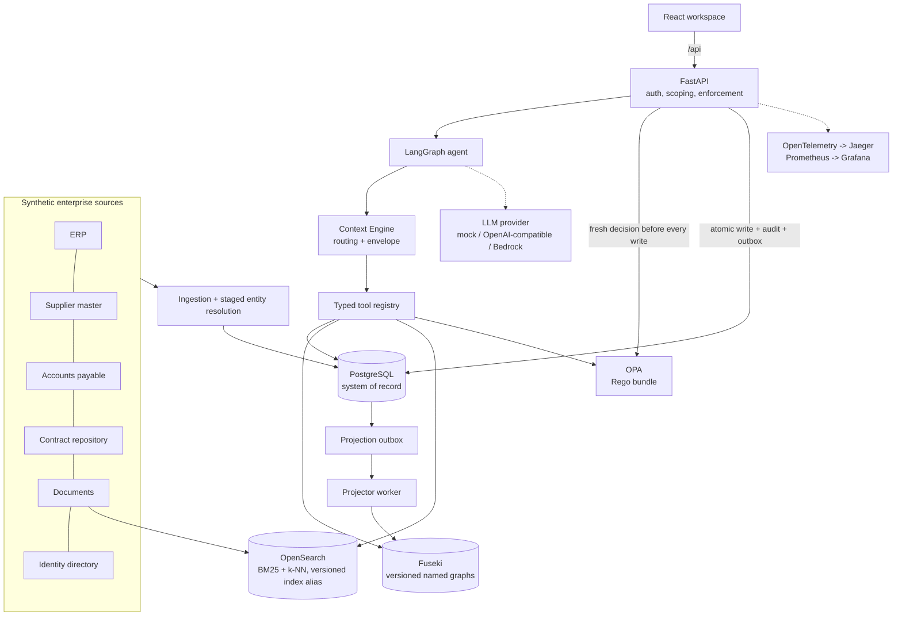
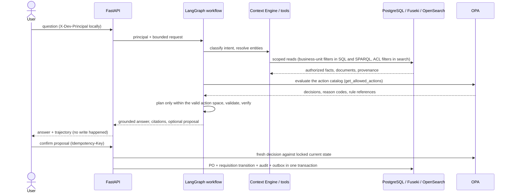

# Architecture

The platform answers procurement questions and safely proposes actions by combining authoritative transactional data, a semantic context graph, hybrid document retrieval and a policy engine behind a bounded agent. The LLM is never a source of truth, an authorization mechanism or a policy engine.

## Components and authority

| Information | Authority | Derived representations |
|---|---|---|
| Requisitions, purchase orders, contracts, principals, approvals, idempotency, audit | PostgreSQL | RDF projection |
| Raw source records and IDs | Synthetic source files plus the `source_record` table | Canonical mappings, graph provenance |
| Canonical entities and match decisions | PostgreSQL (`supplier_alias`, `source_supplier_identifier`) | Canonical RDF nodes and aliases |
| Ontology, SHACL shapes, SKOS taxonomy | Versioned Turtle files (`ontology/`) | Loaded into every graph build |
| Business policy | Versioned Rego bundle (`policies/`) | Per-request decisions with rule references |
| Policy and contract text | Versioned synthetic documents | OpenSearch index versions behind an alias |
| Allowed actions | Computed per request (catalog + OPA) | Never stored as durable truth |

## Request-time trust boundary

## Consistency model
- Writes happen only in PostgreSQL. Each conversion writes the PO, the requisition state change, an audit event and an outbox event in one transaction.
- The projector claims outbox events (`FOR UPDATE SKIP LOCKED`), applies idempotent SPARQL updates to the current graph version, records each application in a per-graph ledger, retries with capped exponential backoff and dead-letters unknown or exhausted events.
- A graph rebuild publishes a new named graph `urn:ecg:graph:context:vN`, replays committed outbox events onto it while holding the publish lock, and switches readers atomically through `projection_state`. Readers select the version with the SPARQL-protocol `default-graph-uri`. This design was chosen after diagnosing that replacing a populated TDB2 default graph stalls Fuseki indefinitely.
- Search uses versioned indices behind an alias with an atomic alias switch.
- Freshness (graph version, change watermark and policy version) is returned in every context envelope.

## Code map

| Area | Package |
|---|---|
| HTTP contracts, request IDs, metrics | `enterprise_context/api.py` |
| Agent workflow, answer composer, stored runs | `enterprise_context/agents/` |
| Intent routing and context envelope | `enterprise_context/context_engine/` |
| Typed tools, SQL catalog | `enterprise_context/tools/` |
| Graph build, projection, templates, NL-to-SPARQL | `enterprise_context/graph/` |
| Hybrid retrieval and search projection | `enterprise_context/retrieval/` |
| Policy client and models | `enterprise_context/policy/` |
| Transactions, approvals, action catalog | `enterprise_context/domain/` |
| Outbox projector and projection state | `enterprise_context/projection/` |
| Tracing, metrics, JSON logging | `enterprise_context/observability/` |
| Evaluation framework | `enterprise_context/evaluation/` |
