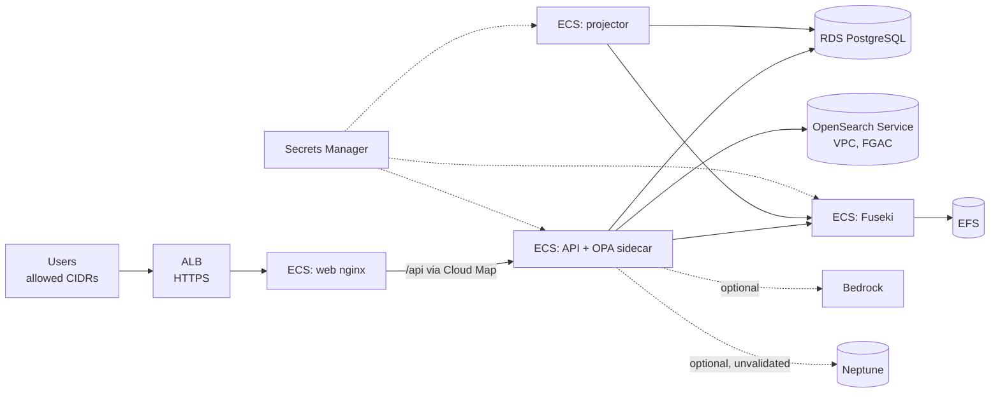

# Deployment

## Local (primary, no cloud account)
Requirements: Docker Engine with Compose v2 and about **8 GB RAM available to Docker** (OpenSearch about 1.2 GB, Fuseki about 1 GB, other services under 1 GB; the optional sentence-transformer tools image adds about 2 GB on disk). On Windows, run Docker Engine inside WSL 2 and give WSL at least 8 GB. With less memory, OpenSearch can be restarted by the OS; the agent then reports `DOCUMENT_SEARCH_UNAVAILABLE` and answers partially until it recovers.

See the README quick start. Useful operations:

| Task | Command |
|---|---|
| Start / stop | `docker compose up -d --build` / `docker compose down` |
| Data pipeline | `make pipeline` (or the `docker compose --profile tools run --rm tools python scripts/...` equivalents) |
| Rebuild projections | `make rebuild-projections` (graph replays the outbox; search swaps the alias) |
| Grafana | `make observability`, then http://127.0.0.1:3000 |
| Reset everything | `docker compose down -v` (removes Postgres, Fuseki, OpenSearch, Prometheus and Grafana volumes), then `make pipeline` |
| Real writes | set `DRY_RUN=false` in `.env`, then `docker compose up -d api` |
| Real LLM | `LLM_PROVIDER=openai_compatible LLM_BASE_URL=http://<ollama>:11434/v1 LLM_MODEL=qwen2.5:3b` |

## AWS (optional, never applied by CI)
`infra/terraform/envs/dev` composes the modules in `infra/terraform/modules`:

Design points: private subnets for every task and data store; only the web service is exposed through the ALB; secrets are injected from Secrets Manager; encryption at rest and in transit everywhere; least-privilege task roles; CloudWatch logs with retention; deployment circuit breakers.

Steps:
1. Build and push the images: API (`apps/api/Dockerfile`, target `runtime`), web (`apps/web/Dockerfile`) and OPA (`infra/docker/opa.Dockerfile`).
2. `cp terraform.tfvars.example terraform.tfvars`, set `allowed_cidrs`, the images and the bucket name.
3. `tofu init` with an **encrypted S3 backend** (state contains generated passwords), then `tofu plan` and review. Apply manually.
4. Run migrations and the data pipeline as one-off ECS tasks using the API image (`python scripts/migrate.py`, ingestion, graph build, search index).

**Identity.** Without an OIDC integration the API refuses requests outside `ENVIRONMENT=local`. `allow_dev_identity = true` is an explicit opt-in for a **private demo only**, with `allowed_cidrs` restricted to your own address.

**Validated vs not validated.** The Terraform is format-checked, validated and linted (OpenTofu and TFLint) in CI. It has not been applied to a real account as part of this project. The Neptune module is provisioned infrastructure only: the graph adapter is tested against Fuseki, and Neptune would need a SigV4-signing adapter and conformance tests. Bedrock access is IAM only; the Bedrock LLM adapter is untested.

## Cost considerations (us-east-1, on-demand, rough monthly estimate)
| Component | Sizing | Approx. USD / month |
|---|---|---|
| NAT gateway (single) | plus data processing | 35–45 |
| Application Load Balancer | low traffic | 18–25 |
| Fargate: API 1 vCPU / 2 GB, Fuseki 1 vCPU / 3 GB, web and projector 0.25 vCPU / 0.5 GB | always on | 90–100 |
| RDS PostgreSQL db.t4g.micro + 20 GB gp3 | single-AZ | 15–20 |
| OpenSearch Service t3.small.search + 10 GB | single node | 28–35 |
| EFS, S3, Secrets Manager, CloudWatch logs | small | 8–15 |
| **Total (excluding Bedrock and Neptune)** | | **about 195–240** |
| Optional Neptune db.t4g.medium | | +60–80 |
| Bedrock | per token | usage-based |

Ways to reduce cost: stop services when idle (`desired_count = 0`), use VPC endpoints instead of NAT for AWS APIs, choose Graviton (`cpu_architecture = "ARM64"` with ARM images), or keep the whole demo local. Check the AWS Pricing Calculator for current prices; these figures are estimates.
